---
## Front matter
title: "Отчет по лабораторной работе №3"
subtitle: "Дисциплина: Архитектура компьютеров"
author: "Машковцева Ксения Сергеевна, НКАбд-02-22"

## Generic otions
lang: ru-RU
toc-title: "Содержание"

## Bibliography
bibliography: bib/cite.bib
csl: pandoc/csl/gost-r-7-0-5-2008-numeric.csl

## Pdf output format
toc: true # Table of contents
toc-depth: 2
lof: true # List of figures
lot: true # List of tables
fontsize: 12pt
linestretch: 1.5
papersize: a4
documentclass: scrreprt
## I18n polyglossia
polyglossia-lang:
  name: russian
  options:
	- spelling=modern
	- babelshorthands=true
polyglossia-otherlangs:
  name: english
## I18n babel
babel-lang: russian
babel-otherlangs: english
## Fonts
mainfont: PT Serif
romanfont: PT Serif
sansfont: PT Sans
monofont: PT Mono
mainfontoptions: Ligatures=TeX
romanfontoptions: Ligatures=TeX
sansfontoptions: Ligatures=TeX,Scale=MatchLowercase
monofontoptions: Scale=MatchLowercase,Scale=0.9
## Biblatex
biblatex: true
biblio-style: "gost-numeric"
biblatexoptions:
  - parentracker=true
  - backend=biber
  - hyperref=auto
  - language=auto
  - autolang=other*
  - citestyle=gost-numeric
## Pandoc-crossref LaTeX customization
figureTitle: "Рис."
tableTitle: "Таблица"
listingTitle: "Листинг"
lofTitle: "Список иллюстраций"
lotTitle: "Список таблиц"
lolTitle: "Листинги"
## Misc options
indent: true
header-includes:
  - \usepackage{indentfirst}
  - \usepackage{float} # keep figures where there are in the text
  - \floatplacement{figure}{H} # keep figures where there are in the text
---

# Цель работы

Целью работы является изучить идеологию и применение средств контроля версий. Приобрести практические навыки по работе с системой git.

# Выполнение лабораторной работы

В первую очередь, мы создаем учетную запись на GitHub (Рис. [-@fig:001]).

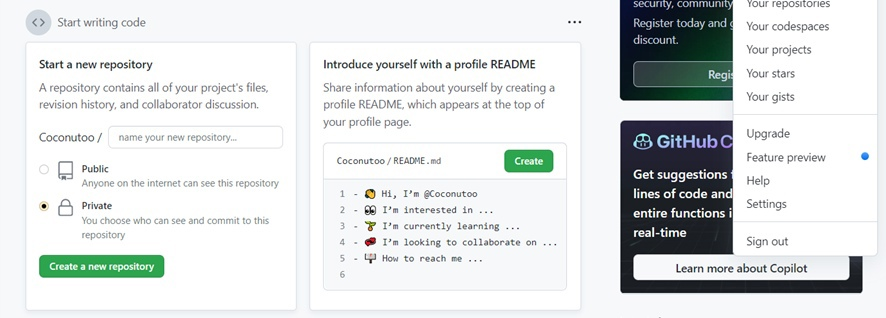{ #fig:001 width=70% }

Далее мы сделаем предварительную конфигурацию Github. Для этого укажем имя и почту владельца репозитория, настроим utf-8 в выводе сообщений git, зададим имя начальной ветки и параметры (Рис. [-@fig:002]).

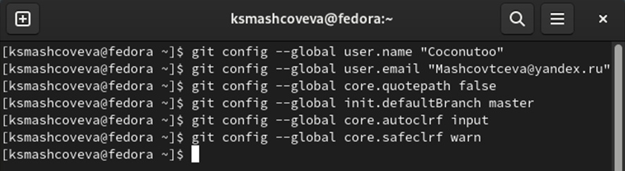{ #fig:002 width=70% }

Далее мы генерируем ssh ключ. С помощью команды мы копируем созданный ssh ключ и вставляем его на сайте GitHub (Рис. [-@fig:003], [-@fig:004]).

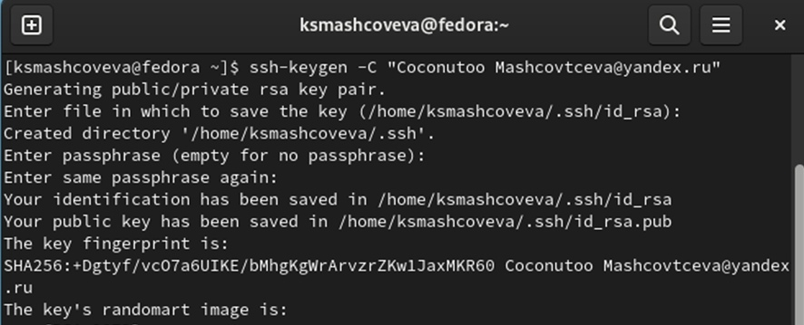{ #fig:003 width=70% }

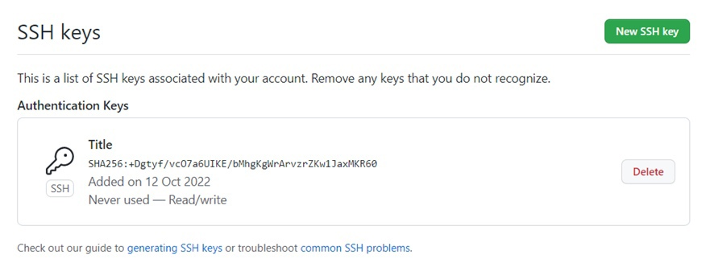{ #fig:004 width=70% }

Далее мы с помощью команды mkdir создаем каталоги. Используя ссылку на шаблон, мы переходим в каталог «Архитектура компьютера» и копируем нужные каталоги в репозиторий (Рис. [-@fig:005], [-@fig:006], [-@fig:007]).

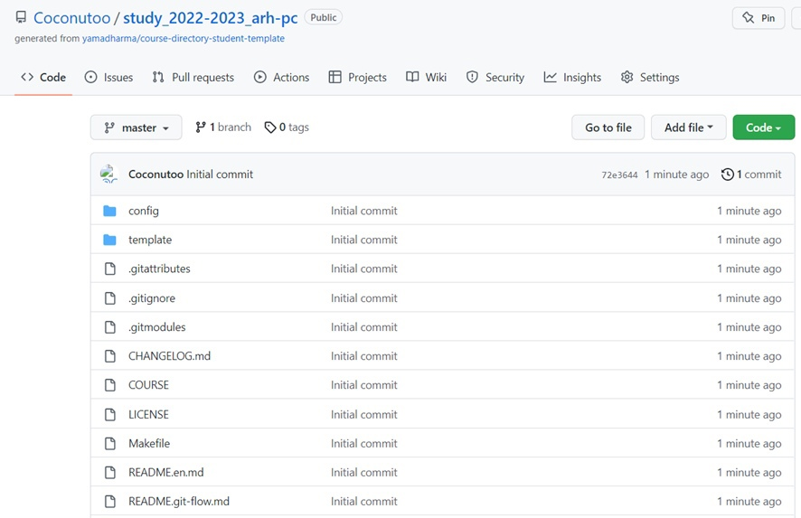{ #fig:005 width=70% }

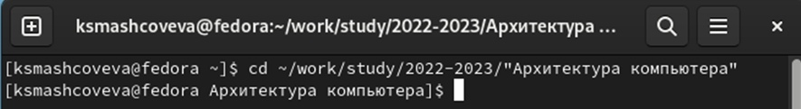{ #fig:006 width=70% }

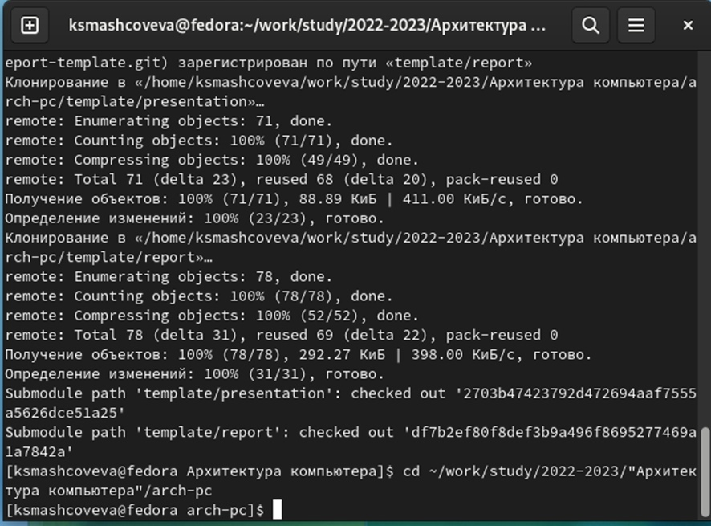{ #fig:007 width=70% }

Удаляем лишние файлы, создаем необходимые каталоги и отправляем файлы на сервер с помощью трех команд (Рис. [-@fig:008], [-@fig:009], [-@fig:010])

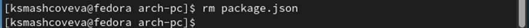{ #fig:008 width=70% }

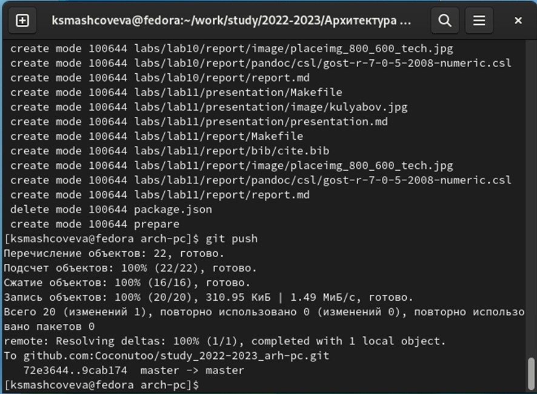{ #fig:009 width=70% }

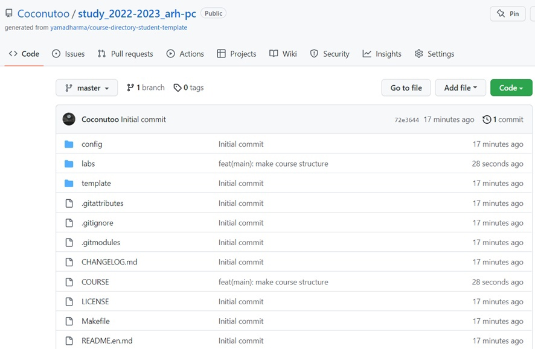{ #fig:010 width=70% }

**Задания для самостоятельной работы**

Скачиваем отчеты по лабораторной работы из ТУИС. Теперь мы можем увидеть первые лабораторные работы в домашней директории. Далее идут попытки переместить эти отчеты в labs и необходимые подкаталоги. Вышло случайно переместить вторую лабораторную работу в папку для первой, далее идут исправление и мы удачно копируем отчеты в нужные папки (рис. [-@fig:011], [-@fig:012], [-@fig:013]).

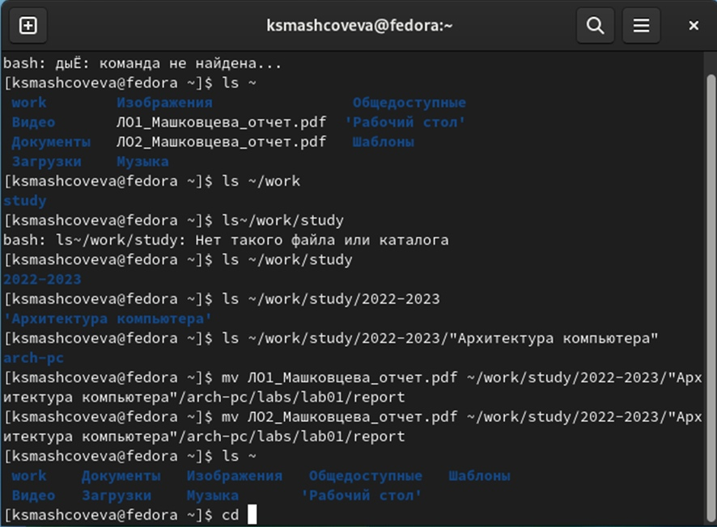{ #fig:011 width=70% }

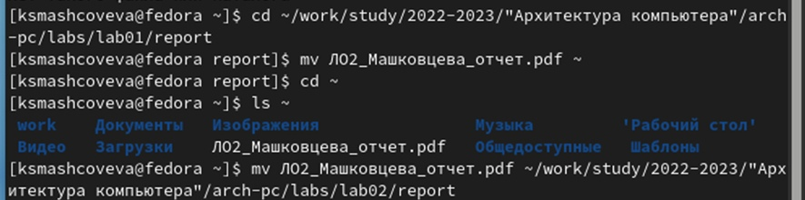{ #fig:012 width=70% }

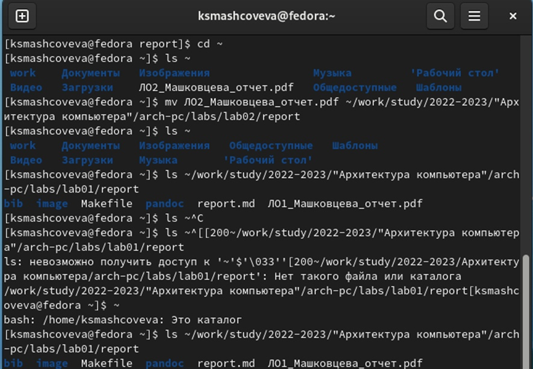{ #fig:013 width=70% }

После перемещения мы копируем файлы в репозиторий (рис. [-@fig:014], [-@fig:015]).

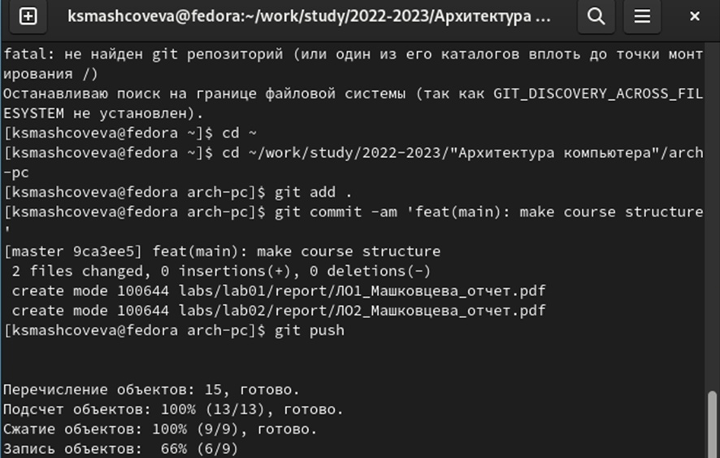{ #fig:014 width=70% }

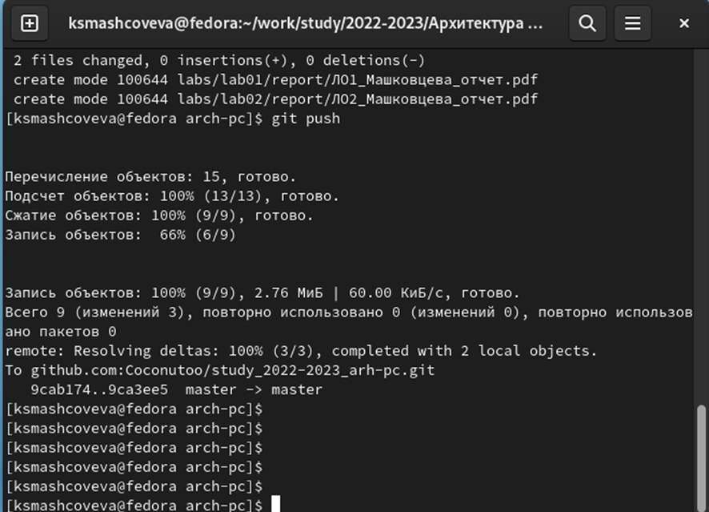{ #fig:015 width=70% }

После этого можно проверить, что файлы перемещены в репозиторий на сайте GitHub (рис. [-@fig:016]).

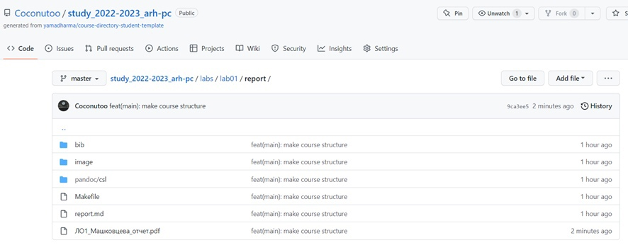{ #fig:016 width=70% }

# Выводы

Мы изучили идеологию и применение средств контроля версий, приобрели практические навыки по работе с системой git. Теперь мы можем работать с репозиторием через командную строку, загружать файлы и добавлять каталоги.
