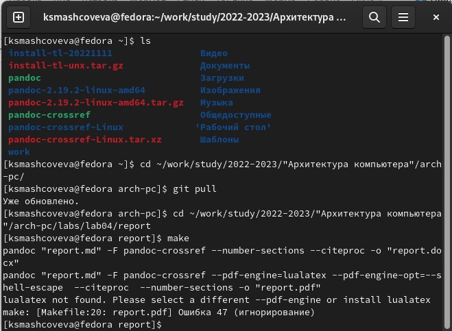
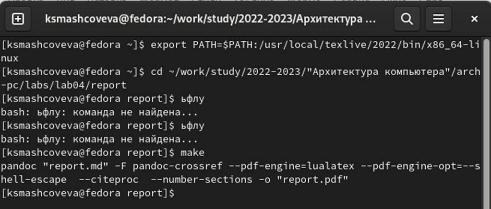
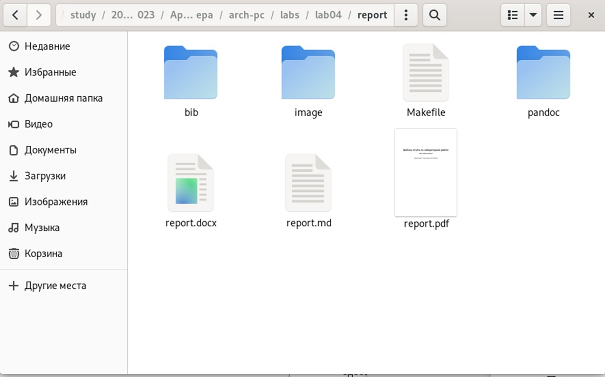
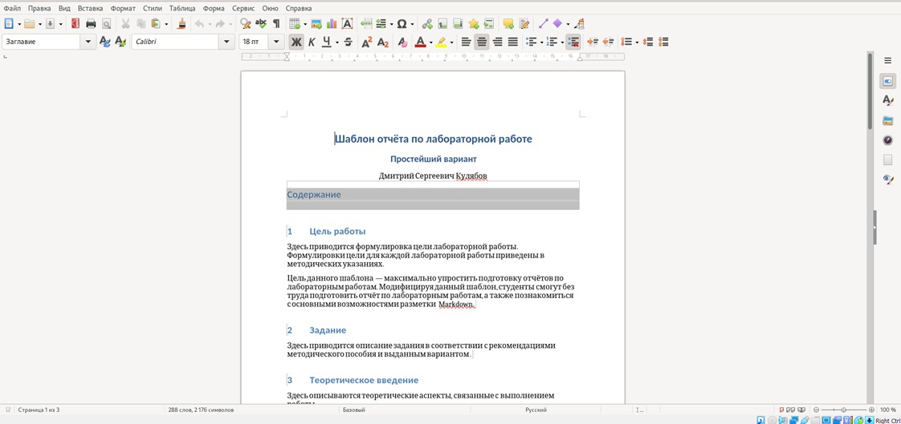
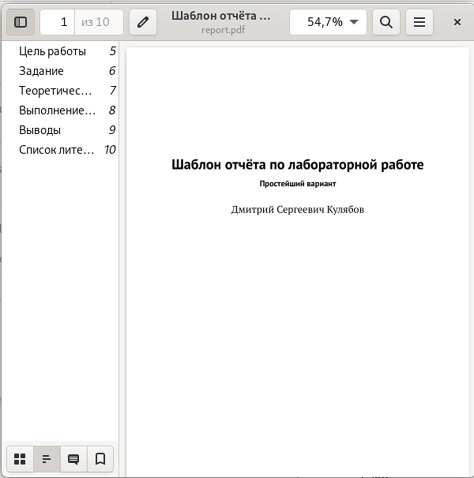
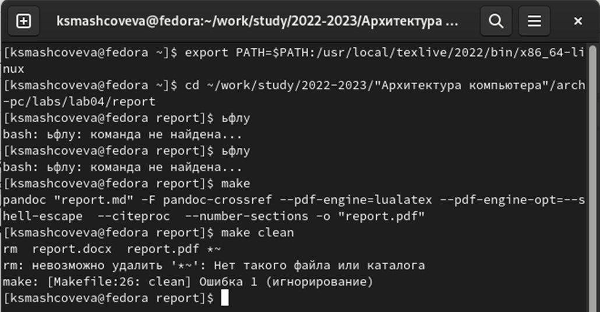
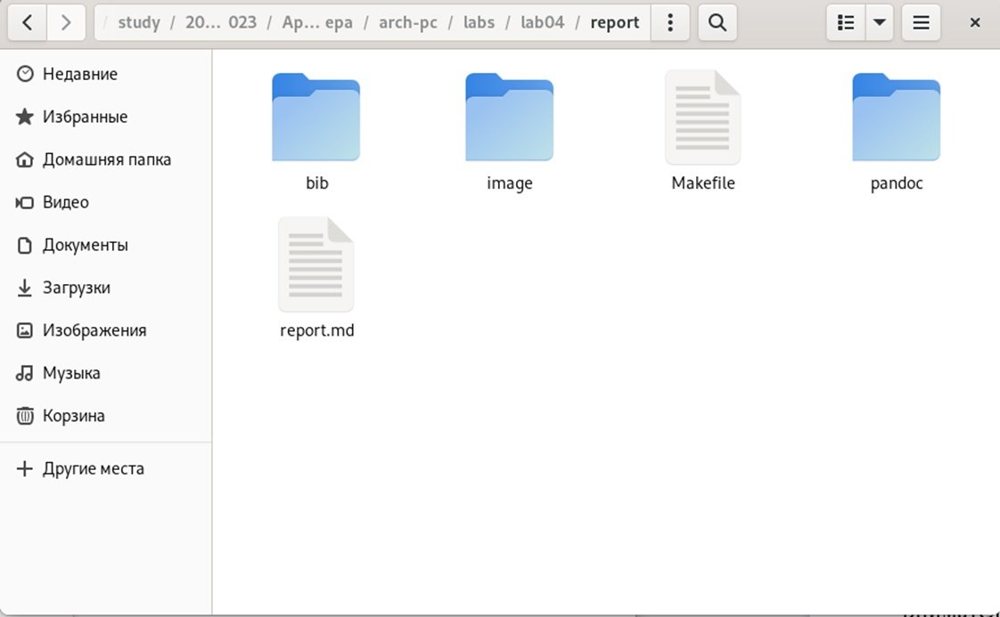
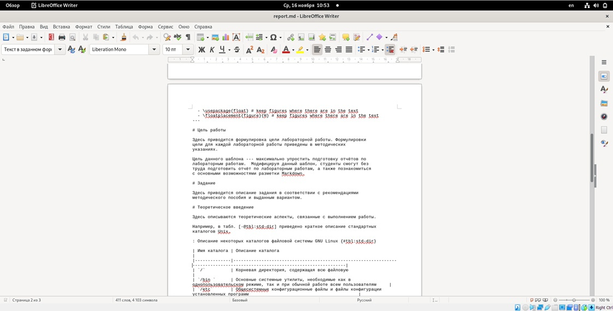

---
## Front matter
title: "Отчёт по лабораторной работе №4"
subtitle: "Дисциплина: Архитектура компьютеров"
author: "Машковцева Ксения Сергеевна"

## Generic otions
lang: ru-RU
toc-title: "Содержание"

## Bibliography
bibliography: bib/cite.bib
csl: pandoc/csl/gost-r-7-0-5-2008-numeric.csl

## Pdf output format
toc: true # Table of contents
toc-depth: 2
lof: true # List of figures
lot: true # List of tables
fontsize: 12pt
linestretch: 1.5
papersize: a4
documentclass: scrreprt
## I18n polyglossia
polyglossia-lang:
  name: russian
  options:
	- spelling=modern
	- babelshorthands=true
polyglossia-otherlangs:
  name: english
## I18n babel
babel-lang: russian
babel-otherlangs: english
## Fonts
mainfont: PT Serif
romanfont: PT Serif
sansfont: PT Sans
monofont: PT Mono
mainfontoptions: Ligatures=TeX
romanfontoptions: Ligatures=TeX
sansfontoptions: Ligatures=TeX,Scale=MatchLowercase
monofontoptions: Scale=MatchLowercase,Scale=0.9
## Biblatex
biblatex: true
biblio-style: "gost-numeric"
biblatexoptions:
  - parentracker=true
  - backend=biber
  - hyperref=auto
  - language=auto
  - autolang=other*
  - citestyle=gost-numeric
## Pandoc-crossref LaTeX customization
figureTitle: "Рис."
tableTitle: "Таблица"
listingTitle: "Листинг"
lofTitle: "Список иллюстраций"
lotTitle: "Список таблиц"
lolTitle: "Листинги"
## Misc options
indent: true
header-includes:
  - \usepackage{indentfirst}
  - \usepackage{float} # keep figures where there are in the text
  - \floatplacement{figure}{H} # keep figures where there are in the text
---

# Цель работы

Целью работы является освоение процедуры оформления отчетов с помощью
легковесного языка разметки Markdown.

# Выполнение лабораторной работы

Для начала я попыталась скачать TexLive. Я скачала каталог с сайта и мне пришлось раскрывать его через файловую систему, поскольку имена в лабораторной работе и в каталоге отличались. Далее я запустила загрузку и дождалась скачивания, после чего самостоятельно скачала pandoc и pandoc-crossref и распаковала их через файловую систему.
Далее я перешла в каталог курса, сформированный при выполнении лабораторной работы №3 и обновила локальный репозиторий, используя команду git pull. 
Далее я перешла в каталог с шаблоном отчета по лабораторной работе №4 и ввела команду make. Файл report.docx успешно скомпилировался, а вот с report.pdf возникли проблемы (рис. [-@fig:001]).

{ #fig:001 width=70% }

Я снова ввела команду export PATH и снова команду make, после чего мне удалось создать оба файла, что я проверила через файловую систему (рис. [-@fig:002]), (рис. [-@fig:002]).

{ #fig:002 width=70% }

{ #fig:003 width=70% }

Далее я проверила содержание самих файлов (рис. [-@fig:004]), (рис. [-@fig:005]).

{ #fig:004 width=70% }

{ #fig:005 width=70% }

Далее я удаляю скомпилированные файлы с помощью команды make clean и проверяю их отсутствие (рис. [-@fig:006]), (рис. [-@fig:007]).

{ #fig:006 width=70% }

{ #fig:007 width=70% }

Затем я открываю файл report.md с помощью текстового редактора и изучаю его структуру (рис. [-@fig:008]).

{ #fig:008 width=70% }

Далее я внимательно изучаю необходимое содержимое отчета и заполняю его с использованием стиля оформления MarkDown. Далее я загружу файлы на github и туис.

# Выводы

Итак, я загрузила TexLive и pandoc, научилась работать с markdown и создавать необходимые для отчета файлы, а также заполнять предоставленный шаблон.
